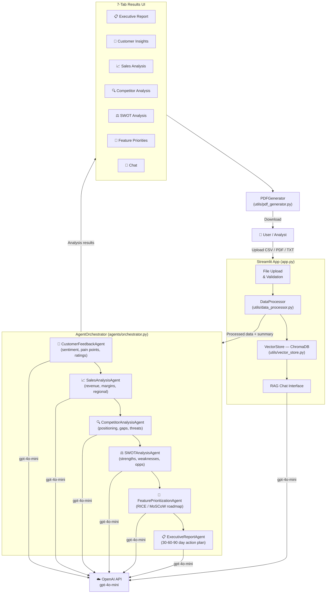

# AI-Powered Product Strategy Assistant

A multi-agent AI application that transforms raw business data (sales CSVs, customer reviews, market documents) into actionable product strategy insights — complete with SWOT analysis, feature prioritization, and board-ready executive reports.

---

## Architecture Diagram



---

## Project Structure

```
product-strategy-assistant/
├── app.py                          # Main Streamlit application
├── requirements.txt                # Python dependencies
├── .env.example                    # Environment variable template
├── agents/
│   ├── orchestrator.py             # Sequential 6-agent pipeline
│   ├── customer_feedback_agent.py  # Sentiment & pain-point analysis
│   ├── sales_analysis_agent.py     # Revenue, margin & regional analysis
│   ├── competitor_analysis_agent.py# Market positioning & gap analysis
│   ├── swot_analysis_agent.py      # Evidence-backed SWOT synthesis
│   ├── feature_prioritization_agent.py  # RICE/MoSCoW roadmap
│   └── executive_report_agent.py   # Board-ready executive summary
└── utils/
    ├── data_processor.py           # CSV / PDF / TXT file parsing
    ├── vector_store.py             # ChromaDB semantic search (RAG)
    └── pdf_generator.py            # ReportLab PDF export
```

---

## Features

- **Multi-Agent Pipeline** — 6 specialized agents run sequentially, each feeding enriched context to the next
- **RAG Chat** — Ask natural-language questions; answers grounded in your uploaded documents via ChromaDB
- **Supports CSV, PDF, TXT** — Sales data, market research, customer reviews
- **SWOT Visualizer** — Color-coded interactive SWOT board
- **PDF Export** — One-click board-ready report download
- **Gateway-Compatible** — Uses `gpt-4o-mini` via OpenAI-compatible gateway

---

## Quick Start

### 1. Clone the repository
```bash
git clone <your-repo-url>
cd product-strategy-assistant
```

### 2. Install dependencies
```bash
pip install -r requirements.txt
```

### 3. Configure environment
```bash
cp .env.example .env
# Edit .env and set your OPENAI_API_KEY
```

### 4. Run the app
```bash
streamlit run app.py
```

### 5. Upload data
In the sidebar, upload `Sample Sales Data.csv` (or any CSV/PDF/TXT), then click **Run Analysis**.

---

## Environment Variables

| Variable | Description |
|---|---|
| `OPENAI_API_KEY` | Your OpenAI / gateway API key |

---

## Agent Pipeline

| Step | Agent | Input | Output |
|---|---|---|---|
| 1 | CustomerFeedbackAgent | Raw data summary | Sentiment report |
| 2 | SalesAnalysisAgent | CSV analysis | Revenue & margin report |
| 3 | CompetitorAnalysisAgent | Raw data + steps 1–2 | Market positioning report |
| 4 | SWOTAnalysisAgent | Steps 1–3 | Full SWOT + strategic implications |
| 5 | FeaturePrioritizationAgent | Steps 1, 2, 4 | RICE/MoSCoW feature roadmap |
| 6 | ExecutiveReportAgent | All prior outputs | 30-60-90 day executive report |

---

## Deployment — Railway

1. Push this repo to GitHub (ensure `.env` is in `.gitignore`)
2. Go to [railway.app](https://railway.app) → **New Project** → **Deploy from GitHub repo**
3. Select this repository
4. In the Railway dashboard go to **Variables** and add:
   ```
   OPENAI_API_KEY = learner042
   ```
5. Railway auto-detects `railway.toml` and deploys — your live URL will be shown under **Settings → Domains** (click **Generate Domain**)

---

## Tech Stack

| Layer | Technology |
|---|---|
| UI | Streamlit |
| LLM | OpenAI `gpt-4o-mini` |
| Vector DB | ChromaDB (ephemeral, in-memory) |
| PDF | ReportLab |
| PDF parsing | pypdf |
| Data | pandas, numpy |
| Env | python-dotenv |
